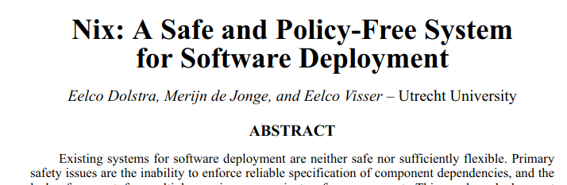
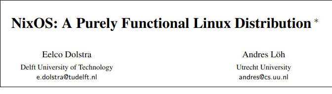
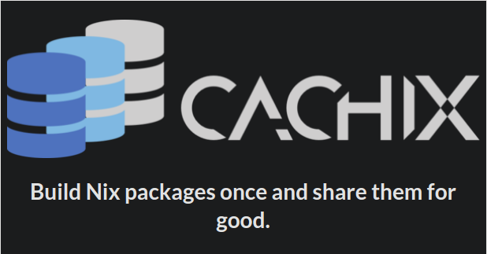
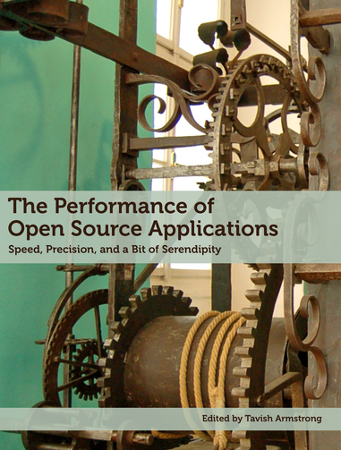
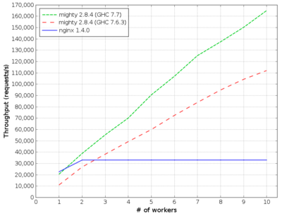
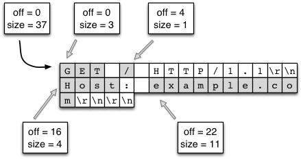

# Table of Contents

1.  [How Familiar is everyone with FP](#org80ac518)
    1.  [Disclaimer, not an expert](#orgc6eb941)
    2.  [Choose some project](#orgd33fd55)
    3.  [Goals](#orgb4abed4)
    4.  [For whom is this talk for?](#org562f669)
    5.  [slant.co&rsquo;s opinions](#orga463561)
    6.  [Really?](#orgddd1bbe)
    7.  [Functional Programming Primer](#org0b4fc1c)
2.  [What is the problem?](#orgf826cd6)
    1.  [What is the problem?](#orgaa9f7fc)
    2.  [Some modern day package management systems](#org2a05607)
    3.  [What about sub ecosystems?](#org4a775d9)
    4.  [How to make a package manager?](#orge32037e)
    5.  [How to make a package manager?](#orge6ce7ea)
        1.  [real senario](#org91bcacd)
    6.  [Problems with modern package management](#orgc51ae6e)
    7.  [Why imperative is bad? What is so imperative about installing packages?](#orgb23da16)
    8.  [Are you familiar with `DEPENDENCY HELL`?](#orgfca101d)
    9.  [All types of &ldquo;DEPENDENCY HELL&rdquo;](#org0de958d)
    10. [Not Atomic 01](#org5d5ef04)
    11. [Not Atomic 02](#orga2ac778)
    12. [Whats bad about imperative summary?](#org21daf0e)
3.  [What it should/could/would have been?](#orgbc0b3db)
    1.  [GUIX vs Nix](#orgc952dc7)
    2.  [Introducing Nix Package Management](#org21a4a01)
    3.  [Main mechanism](#org70956fe)
    4.  [What you get for free with this mechanism?](#org4d54f3d)
        1.  [no `sudo`, where is my `sudo`?](#orgc44b8a7)
        2.  [easy revert, rollback](#orgff45fb5)
        3.  [Select specific version](#orgb89ce1a)
        4.  [Installing and running 2 version of same software](#org905f23f)
        5.  [Same development environment and runtime environment](#org0821ec6)
    5.  [Going all the way, NixOS](#org4d7c2cd)
        1.  [NixOS](#org30f978b)
        2.  [docker](#orgd122ca6)
        3.  [easy cd/dvd](#orge230ca9)
        4.  [easy vm](#org3503369)
4.  [How does nix actually work?](#org1086d42)
    1.  [Nix expressions](#org6956168)
    2.  [Language features](#org3d3dbc5)
    3.  [The main point](#orgf931851)
    4.  [Example: Xmonad](#orgd691de9)
    5.  [Example: Xmonad](#org9411fc0)
    6.  [Main mechanism](#orgd245a5c)
5.  [Nix as infrastructure (imagination)](#org55d79cf)
    1.  [Main componenets](#org29496df)
    2.  [Caching build farm or cachix](#org7720855)
6.  [references](#org2f53872)
7.  [Part 2 Warp optimization](#org54e7307)
    1.  [2013 Results](#orgb7cb4bb)
    2.  [Overall Architecture](#org9b7b704)
    3.  [Type and life cycle](#org038c034)
    4.  [Threads](#orga98a071)
    5.  [As little syscalls as possible](#orgf933b31)
    6.  [Profiling](#org32d15d8)
    7.  [Avoiding locks](#orgfb82800)
    8.  [Using proper datastructure](#orgf29c416)
    9.  [ByteString splicing](#org04ff5fa)

# How Familiar is everyone with FP

## Disclaimer, not an expert

-   Logical fallacies will be used, not too fond of this but ¯\\(ツ)\_/¯.
-   Linux user for 7 years now
    -   Ubuntu
    -   Proxmox
    -   ArchLinux
    -   Centos (server management)

## Choose some project

<https://github.com/search?q=filename%3Ashell.nix&type=Code>

## Goals

-   Functional Programming **Principles** (not only languages)
-   Academic mental exercise (hope not too boring):D
    -   not nessasarily useful
    -   exposure to a **what if?** world
-   No free lunch theorem
    -   PS: you get some free snacks with FP
-   confidence

## For whom is this talk for?

-   A rare case where FP&rsquo;s abilities can be shown
-   State management
-   DevOps
-   Images, Docker, VM, Clusters
-   give you a feel of `Nix`

## slant.co&rsquo;s opinions

## Really?

<https://edolstra.github.io/pubs/nspfssd-lisa2004-final.pdf>
<https://edolstra.github.io/pubs/nixos-icfp2008-submitted.pdf>
<https://edolstra.github.io/pubs/phd-thesis.pdf>

## Functional Programming Primer

-   purity no side effects
    -   whats the point of a program if it cannot change any value?
-   everything is immutable
    -   \(x = 1; x = 2\)
-   lazy
-   memoize everything
-   extreme composability
-   keep as much information in the program as possible
    -   i.e. not a lot of reduce operations

# What is the problem?

-   Modern smart phones vs old phones
-   What OS has everyone used?
    -   windows
    -   ubuntu/mac apt-get brew

## What is the problem?

-   multiple versions
-   mutability
    -   mysql-python
-   not accurate dependency graph
-   dependency hell

## Some modern day package management systems

<table border="2" cellspacing="0" cellpadding="6" rules="groups" frame="hsides">

<colgroup>
<col  class="org-left" />

<col  class="org-left" />
</colgroup>
<thead>
<tr>
<th scope="col" class="org-left">Package manager</th>
<th scope="col" class="org-left">Distributions</th>
</tr>
</thead>

<tbody>
<tr>
<td class="org-left">apt, apt-get</td>
<td class="org-left">Debian, Ubuntu</td>
</tr>

<tr>
<td class="org-left">rpm, yum</td>
<td class="org-left">Redhat, Centos</td>
</tr>

<tr>
<td class="org-left">pacman</td>
<td class="org-left">ArchLinux</td>
</tr>

<tr>
<td class="org-left">brew</td>
<td class="org-left">MacOS</td>
</tr>
</tbody>
</table>

## What about sub ecosystems?

<table border="2" cellspacing="0" cellpadding="6" rules="groups" frame="hsides">

<colgroup>
<col  class="org-left" />

<col  class="org-left" />
</colgroup>
<thead>
<tr>
<th scope="col" class="org-left">Package manager</th>
<th scope="col" class="org-left">???</th>
</tr>
</thead>

<tbody>
<tr>
<td class="org-left">pip, virtualenv, pipenv</td>
<td class="org-left">Python2,3(???)</td>
</tr>

<tr>
<td class="org-left">npm, yarn</td>
<td class="org-left">Nodejs</td>
</tr>

<tr>
<td class="org-left">cabal, stack, hackage</td>
<td class="org-left">Haskell :)</td>
</tr>

<tr>
<td class="org-left">go?</td>
<td class="org-left">go?</td>
</tr>

<tr>
<td class="org-left">brew</td>
<td class="org-left">MacOS</td>
</tr>

<tr>
<td class="org-left">use-package, vim, fish, zsh</td>
<td class="org-left">&#x2026;</td>
</tr>
</tbody>
</table>

## How to make a package manager?

-   What are the basic parts that we need?

## How to make a package manager?

<table border="2" cellspacing="0" cellpadding="6" rules="groups" frame="hsides">

<colgroup>
<col  class="org-left" />

<col  class="org-left" />
</colgroup>
<tbody>
<tr>
<td class="org-left">build dependencies</td>
<td class="org-left">What do I need to build the program?</td>
</tr>

<tr>
<td class="org-left">runtime dependencies</td>
<td class="org-left">What <code>.so</code> shared objects do I need?</td>
</tr>

<tr>
<td class="org-left">configurations</td>
<td class="org-left">What in <code>/etc/...</code> config files</td>
</tr>
</tbody>
</table>

-   essentially think of it as a graph, whenever we upgrade or install a package,
    we are mutating a node on this graph to point to something else.

### real senario

    pkgname=pacman
    pkgver=5.1.0
    _pkgver=1.0.0
    pkgrel=2
    pkgdesc="A library-based package manager with dependency support"
    arch=('i686' 'x86_64')
    url="http://www.archlinux.org/pacman/"
    license=('GPL')
    groups=('base' 'base-devel')
    depends=('bash>=4.2.042-2' 'glibc>=2.17-2' 'libarchive>=3.1.2' 'curl>=7.39.0'
             'gpgme' 'archlinux-keyring' 'manjaro-keyring' 'pacman-mirrors>=4.1.0')
    checkdepends=('python2' 'fakechroot')
    makedepends=('asciidoc' 'pacman>=5.1')
    optdepends=('haveged: for pacman-init.service')
    provides=('pacman-contrib' 'pacman-init')
    conflicts=('pacman-contrib' 'pacman-init')
    replaces=('pacman-contrib' 'pacman-init')
    backup=(etc/pacman.conf etc/makepkg.conf)
    install=pacman.install
    options=('strip' 'debug')

## Problems with modern package management

<https://wiki.debian.org/DontBreakDebian#Don.27t_make_a_FrankenDebian>

## Why imperative is bad? What is so imperative about installing packages?

Mutation

## Are you familiar with `DEPENDENCY HELL`?

-   <https://www.reddit.com/r/ProgrammerHumor/comments/75txp4/nodejs_dependency_hell_visualized_for_the_first/?utm_source=share&utm_medium=web2x>
-   <https://github.com/vector-im/riot-web/network/dependencies>

## All types of &ldquo;DEPENDENCY HELL&rdquo;

-   { DLL, dependency, npm, cabal } hell, different names for the same demon
-   conflicting dependency
    -   shared components like library links `cuda.7.so` vs `cuda.6.so`
-   multiple version side by side and roll backs
-   possible solutions
    -   set of stable packages like `Debian` or `haskell stack snapshots`

## Not Atomic 01

-   kill upgrades half way
    -   packages left in a semi updated state
    -   sometimes need to manually remove lock files

    COMMAND   PID USER   FD   TYPE DEVICE SIZE/OFF   NODE NAME
    dpkg    29329 root    3uW  REG    8,7        0 262367 /var/lib/dpkg/lock

## Not Atomic 02

-   can be fixed but kinda troublesome.

## Whats bad about imperative summary?

-   No Variability
    -   cannot point to older versions of the same thing
-   Dependency hell
    -   conflicting dependencies
-   Not atomic upgrades
    -   unknown state if break half way

These problems are really similar to the problems with imperative languages!
like `JAVA` and people have already made solutions for them like how `Haskell`
does. We could learn a thing or two from them.

# What it should/could/would have been?

-   Imagine now that we implemented all the things of a functional programming
    language to create a functional package management system?
-   What can we do with this?

## GUIX vs Nix

-   
-   

## Introducing Nix Package Management

-   solves all of the problems above
    -   Can point to different versions of the same thing
        -   cannot point to older versions of the same thing
    -   Dependency hell
    -   Not atomic upgrades
        -   unknown state if break half way

## Main mechanism

-   install everything in path `/nix/store/{hash}-name`
-   via `symlinking`

## What you get for free with this mechanism?

-   no `sudo`
-   easy revert and roll back
-   select specific version
-   2 different version can run at the same time
-   same **development** environment as the **runtime** environment!
    -   nix-shell

### no `sudo`, where is my `sudo`?

-   linux was developed as a `time sharing` system
-   many users were expected to share a single computer.
-   thus to manage conflicts, a `super user`, `root` was required to
    install and manage packages

    nix-env -iA nixos.figlet

### easy revert, rollback

    figlet "I am here!"

    nix-env --rollback

    figlet "are you still here?"

### Select specific version

    cd ~/projects/nix-config/
    git checkout ??
    nix-env -f ~/projects/nix-config/ -iA screenfetch

screenfetch 2016 vs current

### Installing and running 2 version of same software

    stack --version
    su
    stack --version

### Same development environment and runtime environment

-   I am not an electrical engineer or something but I program my
    own keyboard. So I need some sort of firmware flasher. like
    `dfuprogrammer` I dont need it on my system.

    cd ~/projects/qmk_firmware/
    make
    dfuprogrammer
    nix-shell
    make
    dfuprogrammer

## Going all the way, NixOS

-   whole system management via Nix and thus NixOS
    -   Version controlled operating system
    -   show OS reboot
    -   I wanted to show my generations so had been delaying removing
        my older generations

    df -h /
    nix-collect-garbage --delete-older-than 10 --dry-run

### NixOS

-   show <file:///home/df/nix-config/configuration.nix>
-   python package management <file:///home/df/nix-config/configuration.nix>
-   gnupg agent <file:///home/df/nix-config/configuration.nix>
-   ports <file:///home/df/nix-config/configuration.nix>
    -   I think it helps me get a state of all the ports in one place
-   users and security all in one place
    <file:///home/df/nix-config/configuration.nix>
    -   authorisedkeys
-   postgresql can be packaged in `shell.nix`
    <file:///home/df/nix-config/configuration.nix>
    -   separate project called `nixos-shell`
        <https://github.com/chrisfarms/nixos-shell>
-   filesystems <file:///etc/nixos/hardware-configuration.nix>

### docker

<https://nixos.wiki/wiki/Docker>

    virtualisation.docker.enable = true;
    users.users.<myuser>.extraGroups = [ "docker" ];

    nix-build '<nixpkgs>' -A dockerTools.examples.redis
    docker load < result

<https://github.com/NixOS/nixpkgs/blob/master/pkgs/build-support/docker/examples.nix>

### easy cd/dvd

    cd ~/projects/nixpkgs
    nix-build -A config.system.build.isoImage -I nixos-config=modules/installer/cd-dvd/installation-cd-minimal.nix default.nix

### easy vm

    cd ./nixops
    nixops create -d simple02 network.nix
    nixops deploy -d simple02

    deployment.targetEnv = "ec2";
    deployment.region = "eu-west-1";

# How does nix actually work?

## Nix expressions

-   functional expressions, not general purpose please do not program
    things with it
-   comes with its own BNF grammar

## Language features

-   Nix expressions
    -   dynamically typed
    -   lazy
    -   pure

## The main point

-   Nix expressions are here to describe a graph of build actions
    called `derivations`
    -   build script
    -   set of environment variables
    -   set of dependencies

## Example: Xmonad

## Example: Xmonad

## Main mechanism

# Nix as infrastructure (imagination)

-   how might one use nix in `JPMC's` infrastructure?

## Main componenets

-   Hydra caching
-   Dependency management
-   Ease of use
    -   nix-shell
-   Security

## Caching build farm or cachix

# references

-   [HTML] Nix: A Safe and Policy-Free System for Software Deployment.
    -   E Dolstra, M De Jonge, E Visser - usenix.org
    -   <https://nixos.org/~eelco/pubs/nspfssd-lisa2004-final.pdf>
-   [PDF] A Purely Functional Linux Distribution - NixOS
    -   E Dolstra
    -   <https://nixos.org/~eelco/pubs/nixos-jfp-final.pdf>
-   Hydra - NixOS
    -   <https://nixos.org/~eelco/pubs/hydra-scp-submitted.pdf>

# Part 2 Warp optimization

<https://www.aosabook.org/en/posa/warp.html>

## 2013 Results

## Overall Architecture

## Type and life cycle

    type Application = Request -> ResourceT IO Response

## Threads

user threads

## As little syscalls as possible

-   use strace to check what nginx was doing
-   found `accept4`

## Profiling

-   the date string format is taking up most of the cpu time
-   so they made a cache for that
-   btw haskell by default memoised every thing

## Avoiding locks

they used compare and swap instead

## Using proper datastructure

-   `String` in haskell is actually a `List` of `Char`
    -   `List` as in `Linked-lists`
-   `ByteString` so you can do `splicing` like `GO`.
    -   implemented in low level `C`
-   Handroll several components to avoid overhead like the parsing library

## ByteString splicing

Everything in haskell by default is immutable so multiple threads can read it at the same time with no issues.

Updates are done with compare and swap.

